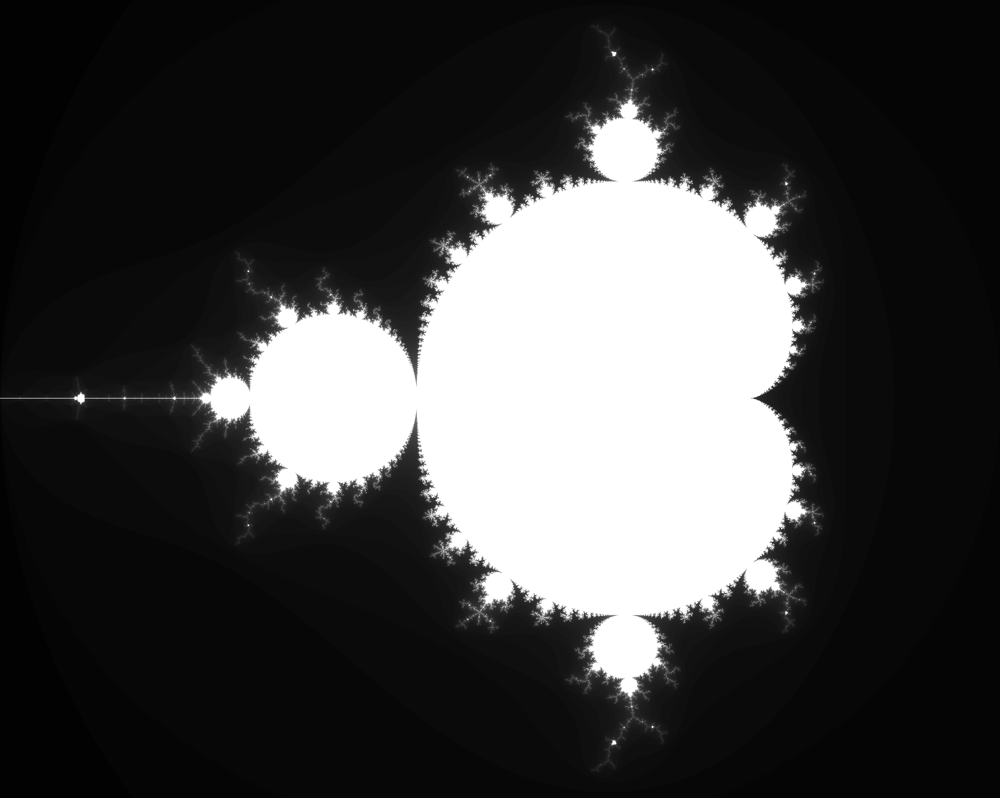

# Mandelbrot set image generator

This is an implementation in Golang of a [Mandelbrot set](https://en.wikipedia.org/wiki/Mandelbrot_set) image generator. It is based on my [previous implementation](https://github.com/mrfelipenoronha/concurrent-and-parallel-programming/tree/master/mandelbrot) of such generator, made in C that time.

## How it works

As is said in Wikipedia:

> The Mandelbrot set is the set of complex numbers _c_ for which the function _f(z) = z² + c_ does not diverge when iterated from _z = 0_,  i.e., for which the sequence _f(0), f(f(0)), etc..._, remains bounded in absolute value.

For the image to be generated, we take the horizontal axis as the real axis and the vertical axis as the imaginary one. This arrangement lets us take each pixel as a number _z = cReal + cImag*i_ and apply it in the function.

In order to determinate if the function diverge or not we shall use two variables: `threshold` and `nIterations`. They tell, respectively, the maximum value the function can assume and the maximum number of iterations of the form _f(f(f(...)))_ can be made. Note that the threshold value passed through command line is the already squared one (default value is 4.0).

## Language aspects

The decision of using Golang is based in the facility the language deal with concurrency and parellelism through **goroutines**. The abstraction and _scope heritage_ provided with `go` call uppon anonymous functions make this implementation much cleaner than the previous one. Using the argument `-nr` the user can set the number of goroutines generated inside the function `calculateSet`.
